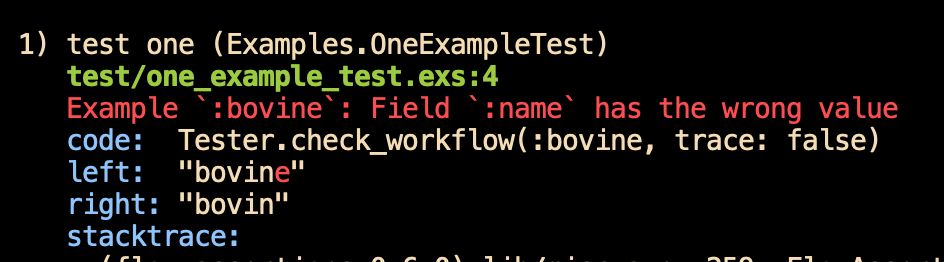

# Why an Ecto Test DSL?

It's easier to write product code that uses Ecto than it is to test that
code. It should be the other way around.

## A minimal example

Suppose you are using Ecto to manipulate an `animals` table in the
database. You want to test the code you write. But there are
problems:

1. A lot of what you need to test is, frankly, boring. Does the
   `changeset` function properly reject a blank field? Are database
   constraint errors put into the changeset? Etc.
   
2. Moreover, those boring checks require more elaborate tests than the
   ideas really deserve. To say "the code rejects an attempt to change the `name` field
   to a name that already exists" requires setting up two
   table rows before you even get to the point of the test.
   
3. Things get even more complicated with associations. Every animal
   `belongs_to` a `species`, which means you can't even create an
   animal without first creating a species. It's a pain to create such
   prerequisites and get the foreign keys in all the right places in
   the test data.
   
This library is all about reducing painful and boring work. It does
that by providing a concise notation for tests and an engine that
executes them using the ExUnit machinery. 

---------

Let's look at that final problem: creating species entries in order to
use their primary keys as foreign keys. That's as simple as this:


```elixir
      bovine: [params(name: "bovine")],
      equine: [params(name: "equine")]
```

(For this example, species have only names.)

Well, you also require some setup work:

```elixir
  use EctoTestDSL.Variants.PhoenixGranular.Insert

  def create_test_data do 
    start(
      module_under_test: Schemas.Species,
      repo: App.Repo
    )
```

But that's not really different than what you'll find at the top of
any `"_test.exs"` file.

## Concise and repeated assertions

`:bovine` and `:equine` are the names of *examples*. Examples are both
tests that use ExUnit and also a source of test data (much like what
you'd use `setup` and test
["fixtures"](https://en.wikipedia.org/wiki/Test_fixture#Software) for
in conventional ExUnit tests).

We can add to an example to describe how the final result should be
checked:

```elixir
      bovine: [params(name: "bovine"),
               fields(name: "bovine")],   # <<<<<<<<<<<<<
```

`fields` checks that the structure returned by `Ecto.insert` has the
expected values. So if something goes wrong, you can get a nice ExUnit-style message:



Fine. 

But.

Really, the odds of something going wrong are small. This particular
`fields` check basically confirms that the `changeset` function
doesn't look like this:

```elixir
      def changeset(struct, params) do 
        struct
        |> cast(params, [:id]    #### Oops, forgot `:name`.
        |> ...
```

That's not a mistake that's unlikely to go unnoticed for long. However,
there's some value to documenting in a test that certain fields are
always just `cast`, not calculated in some more elaborate way.

As long as it's *easy*.

Since that's a property of the field, not of any particular example,
it's done like this:
   
```elixir
       start(...)
       
       field_transformations(as_cast: [:id, :name])
       ....
```
   

The `as_cast` `field_transformation` instructs the execution engine to
add an appropriate `fields` check to *every* example. That's not the
only transformation, but it's enough for now.

## Workflows define what gets done and what gets checked

Both `:bovine` and `:equine` are part of the `:success`
*workflow*:

```elixir
    workflow(                                         :success,
      bovine: [params(name: "bovine")],
      equine: [params(name: "equine")]
    )
```

A workflow instructs the execution engine. In this `:success` case,
it instructs it to:

1. Convert the parameters so they are in the format Phoenix delivers to a
   controller (mostly, turn keys and values into strings the
   way EEx does), 
   
2. Call the module-under-test's designated changeset function (by default, `changeset`), 

3. Check that the result is a `:valid` changeset, 

4. Check the changeset values defined by the global transformations
   (`as_cast` and others), as well as specific checks that can look
   like this:
   
   ```elixir
   changeset(changes: [name: "bossie"], errors: [...])
   ```
       
5. Insert the changeset (using, by default, `Repo.insert`),

6. Check that the result matches `{:ok, struct}`, and

7. Check the field values in `struct` (if desired).

Other workflows act differently. For example, the `:constraint_error` workflow
is about insertion failures due to database constraints:


```elixir
    workflow(                             :constraint_error,
       duplicate_name: [
         previously(insert: :bovine),
         params_like(:bovine),
         constraint_changeset(error: [name: "has already been taken"])
       ] ...
```

That implements one easy way to check for unique name constraints:
insert the same params twice. Because that's such a common situation,
it deserves some shorthand:

```elixir
       duplicate_name: [
         insert_twice(:bovine),     # <<<<<<<<<<<
         constraint_changeset(error: [name: "has already been taken"])
       ]
```

There are ways to vary how workflows work or to create your own, as
well as to create shorthand snippets like `insert_twice`.

## Associations and foreign keys

To show how associations work, let's look at inserting an `Animal`. To
do that, we have to first insert a `Species` and get its primary key
into the `params`. That's done like this:

```elixir
    field_transformations(as_cast: [...])

    workflow(                                              :success,
      note_free: [params(name: "Bossie",
                         notes: "",
                         species_id: id_of(bovine: Insert.Species))
                                     ^^^^^^^^^^^^^^^^^^^^^^^^^^^^^
                 ],
```

The mention of `:bovine` prompts the engine to insert it and use its
`id` as the value of `species_id`.

## Generating test data for ordinary ExUnit tests

The code snippet above gives no proof that `:bovine` is actually created.
(Maybe I cheated by having `id_of` ignore its argument and just
return a constant value.) That's easy to check. Here's an example
from the repl:

```elixir
    iex(1)> alias Examples.Schemas20.Insert.Animal.Tester
    iex(2)> EctoTestDSL.start
    {:ok, #PID<0.311.0>}
    
    iex(3)> Tester.params(:note_free)
    %{"name" => "Bossie", "notes" => "", "species_id" => "860"}
    
    iex(4)> App.Repo.get(Schemas.Species, 860)
    %App.Schemas20.Species{
      __meta__: #Ecto.Schema.Metadata<:loaded, "species">,
      animals: #Ecto.Association.NotLoaded<association :animals is not loaded>,
      id: 860,
      inserted_at: ~N[2021-02-28 22:02:32],
      name: "bovine",
      updated_at: ~N[2021-02-28 22:02:32]
    }
```

Functions like `Tester.params` effectively stop a workflow in the
middle and return the value of the final step. That means
examples can be used as fixtures for regular ExUnit tests. For
instance, you could write a controller test that checks animal deletion
like this:


```elixir
    test "deletion by id", %{conn: conn} do 
      animal = Tester.inserted(:note_free)
      conn = delete(conn, Routes.animal_path(conn, :delete, animal))
      ...
    end
```

## Summary

Every single day, people are writing Ecto test scaffolding code
that looks the same as everyone else's Ecto test scaffolding code.

That's a tragic waste of precious time. For Ecto-using applications, I
believe we can do better, and I'm betting this library can be a big
part of "better".

I've been in "stealth mode" for long enough. Time to see if there's interest.
